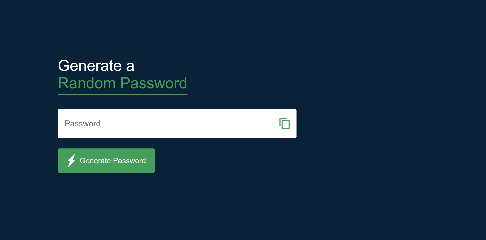

# 🔐 Pass-Maker

Pass-Maker is a simple and secure password generator built using HTML, CSS, and JavaScript. It allows users to generate strong, random passwords with customizable options.

## 📸 Screenshots

### 🏠 Home Page


## 🚀 Features

- ✅ Generate strong, random passwords  
- 🔠 Include uppercase, lowercase, numbers, and symbols  
- 📋 Copy password to clipboard  
- 🎨 Simple and user-friendly interface  

## 🛠️ Tech Stack

- **HTML** - Structure of the app  
- **CSS** - Styling and responsiveness  
- **JavaScript** - Logic for password generation  

## 📌 Installation & Setup

1. Clone the repository:  
   ```sh
   git clone https://github.com/yourusername/pass-maker.git

Open index.html in your browser.

🎯 Usage

Choose character types (uppercase, numbers, symbols).

Click Generate Password to create a strong password.

Click Copy to copy the password to your clipboard.
